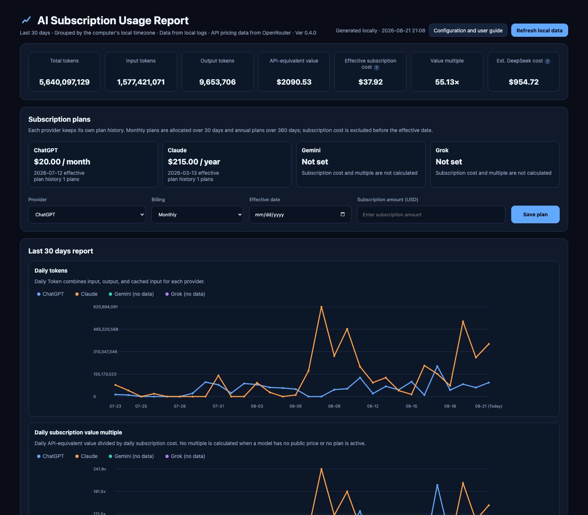
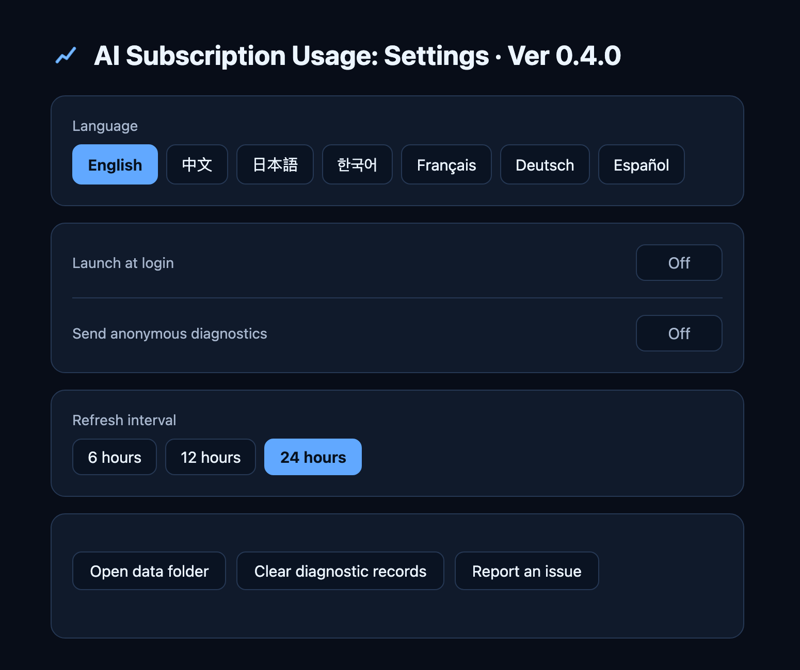
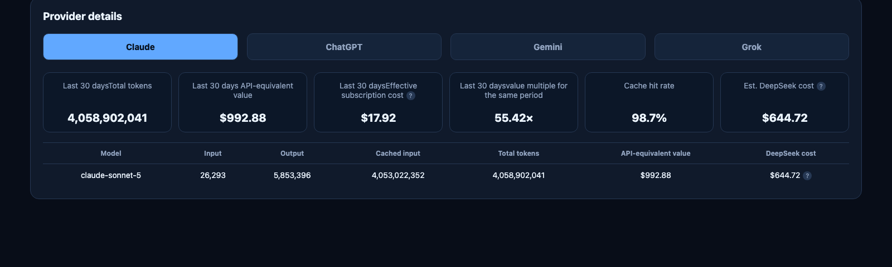
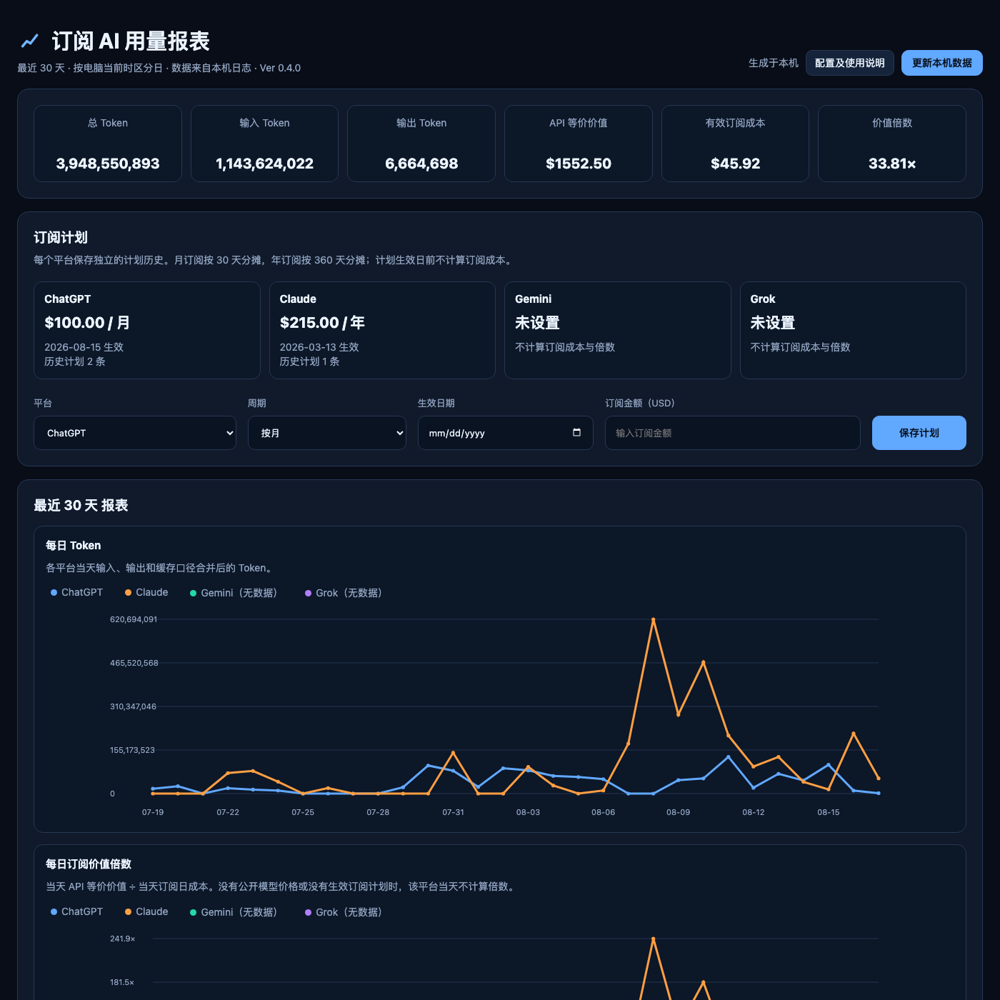

# AI Subscription Usage

[English](README.md) | [简体中文](README.zh-CN.md) | [日本語](README.ja.md) | [한국어](README.ko.md) | [Français](README.fr.md) | **Deutsch** | [Español](README.es.md)

Eine lokale Menüleisten- bzw. System-Tray-App ohne Konto, die lokal gespeicherte Nutzungsprotokolle von ChatGPT, Claude Code, Claude Desktop, Gemini CLI und Grok ausliest und den API-Gegenwert der letzten 30 Tage mit dem tatsächlich gezahlten Abo-Betrag vergleicht. Alles läuft auf dem eigenen Rechner — kein KI-API-Schlüssel, keine Kontoanmeldung, kein Zugriff auf OAuth/Auth Token/Cookies und kein Cloud-Dienst im Spiel.

**Funktionen**
- 30-Tage-Dashboard: Gesamt-/Eingabe-/Ausgabe-Token, API-Gegenwert, effektive Abokosten und Wertfaktor, pro Anbieter
- Tägliche Token- und Wertfaktor-Diagramme, Aufschlüsselung nach Modell
- Verlauf der Abo-Pläne (monatlich/jährlich, anteilig nach Gültigkeitsdatum)
- Automatische Erkennung lokaler Nutzungsprotokolle, mit einer sicheren Whitelist-Methode für nicht standardmäßige Ordner
- Preise für unterstützte Modelle werden automatisch etwa einmal pro Woche aus den öffentlichen API-Preisdaten von [OpenRouter](https://openrouter.ai/) aktualisiert — keine manuelle Pflege nötig
- Sieben Sprachen: English, Français, Deutsch, Español, 简体中文, 日本語, 한국어
- Start bei Anmeldung, einstellbares Aktualisierungsintervall, Ein-Klick-Zugriff auf den lokalen Datenordner
- Nur optionale, anonymisierte Diagnosedaten — niemals Gesprächsinhalte, Dateipfade oder Zugangsdaten

**Screenshots**

| Bericht | Einstellungen |
| --- | --- |
|  |  |

Details pro Anbieter (Token und Wert je Modell) sowie derselbe Bericht auf Chinesisch:




**Installation**

Laden Sie die aktuelle Version von der [Releases](../../releases)-Seite herunter:
- **macOS**: `AI-Subscription-Usage-macOS.zip` — entpacken und `AI Subscription Usage.app` in den Programme-Ordner verschieben.
- **Windows**: `AI-Subscription-Usage-Windows-Setup.exe` für eine normale Installation (Startmenü-Verknüpfung, ordentliche Deinstallation) oder `AI-Subscription-Usage-Windows-Portable.zip`, wenn Sie lieber nur entpacken und die .exe direkt ausführen möchten, ohne dass etwas in die Registry oder nach Program Files geschrieben wird.

Jede Version enthält außerdem eine `SHA256SUMS.txt` zur Überprüfung des Downloads. Der Windows-Build wird in der CI kompiliert und automatisch getestet, wurde aber noch nicht auf einem echten Windows-Rechner von Hand getestet — siehe Tabelle unten.

Lieber selbst aus dem Quellcode bauen?

```bash
python3 -m venv .venv-desktop
.venv-desktop/bin/pip install -r requirements-desktop.txt
.venv-desktop/bin/pip install pyinstaller
.venv-desktop/bin/pyinstaller --clean --noconfirm ai-subscription-usage.spec
```

Der macOS-Build landet in `dist/AI Subscription Usage.app`, der Windows-Build in `dist/AI Subscription Usage.exe`.

## Was bisher verifiziert ist

| Plattform | macOS (Desktop + CLI) | Windows (Desktop + CLI) |
| --- | --- | --- |
| ChatGPT | ✅ Funktioniert, verifiziert | 🟡 Gleicher Codepfad, sollte funktionieren — nicht auf echtem Windows getestet |
| Claude | ✅ Funktioniert, verifiziert (Desktop und CLI teilen sich dasselbe Protokoll) | 🟡 Desktop hat einen eigenen Windows-Pfad; CLI sollte ebenfalls funktionieren — nicht auf echtem Windows getestet |
| Gemini CLI | ✅ Funktioniert, verifiziert | 🟡 Sollte funktionieren — nicht auf echtem Windows getestet |
| Gemini Desktop (Antigravity/Spark) | ❌ Bestätigt nicht möglich | ❌ Vermutlich ebenfalls nicht möglich (gleiches Produkt) — nicht gezielt bestätigt |
| Grok | 🟡 Code sollte korrekt sein, aber es gibt auf diesem Rechner keine echten Grok-Daten zur Überprüfung | 🟡 Ebenfalls nicht verifiziert, und Windows-Tests haben ebenfalls nicht stattgefunden |

Gemini Desktop (Antigravity/Spark) schreibt lokale Sitzungsdateien verschlüsselt (`~/.gemini/antigravity/conversations/*.pb`), ohne lesbare Struktur und ohne dokumentierte, sichere lokale API, sodass die Token-Nutzung dafür nicht ausgelesen werden kann — sie wird als erkannt, aber nicht bepreist angezeigt.

Wenn Sie einen Windows-Rechner besitzen oder Grok tatsächlich nutzen, sind Tests und Feedback besonders willkommen — das sind die beiden Bereiche, die hier nicht verifiziert werden können. Bitte öffnen Sie bei Problemen ein [Issue](../../issues).

## Überblick

Versionsnummern werden im Tray-Menü, auf der Berichtsseite und auf der Hilfeseite angezeigt. macOS speichert Benutzerdaten unter `~/Library/Application Support/AI Subscription Usage/`, Windows unter `%LOCALAPPDATA%\AI Subscription Usage\`. Ein Upgrade ersetzt nur das Programm, die eingebaute Preisdatenbank, die Sprachdateien und die Adapter — Abo-Pläne, Datenquellenkonfiguration, Sprachwahl, Diagnose-Zustimmung und lokale Berichte werden vom Installer nie überschrieben. Vor einer Migration der Einstellungen werden die Originaldateien im Benutzerdatenverzeichnis unter `backups/` gesichert.

Die öffentliche GitHub-Version enthält keine Abo-Pläne, Erkennungsergebnisse, lokalen absoluten Pfade, Token-Zahlen oder erzeugten Berichte — Erkennungsergebnisse werden stets live auf dem Rechner erzeugt, auf dem die App installiert ist. Der Release-Workflow führt zunächst `scripts/privacy_check.py` aus und bricht den Build bei einem Fehler ab.

## Datenquellen

| Plattform | Lokaler Ordner | Was gezählt wird |
| --- | --- | --- |
| ChatGPT | `~/.codex/sessions/` | Internes Codex-JSONL; Eingabe, Ausgabe und Cache-Eingabe |
| Claude Code | `~/.claude/projects/` | Eingabe, Ausgabe, Cache-Lesen und Cache-Schreiben |
| Claude Desktop | `~/Library/Application Support/Claude/local-agent-mode-sessions/` | Erkennt Desktop-Sitzungen; Token-Nutzung wird über das gemeinsame Claude-JSONL-Protokoll aggregiert |
| Gemini CLI | `~/.gemini/tmp/*/chats/` | Eingabe, Ausgabe, Denkprozess- und Cache-Token |
| Antigravity Desktop | `~/.gemini/antigravity/` | Automatisch erkannt; nicht bepreist, solange die Token-Felder des `.pb`-Formats nicht verifiziert sind |
| Antigravity CLI | `~/.gemini/antigravity-cli/` | Automatisch erkannt; nicht bepreist, solange das Format nicht verifiziert ist |
| Grok Build | `~/.grok/logs/unified.jsonl` | Bevorzugt exakte Eingabe-, Ausgabe-, Reasoning- und Cache-Token |
| Grok Build Fallback | `~/.grok/sessions/**/signals.json` | Wird nur verwendet, wenn keine `unified.jsonl` vorhanden ist; als Schätzung gekennzeichnet |

Modellnamen müssen exakt mit `config/pricing.json` übereinstimmen. Bei unbekannten Modellen werden die Token weiterhin gezählt, es wird jedoch kein API-Gegenwert dafür berechnet, und es wird auch nicht der Preis eines anderen Modells angewendet. Die Preisdatenbank kann je Gültigkeitsdatum unterschiedliche Preise speichern; bei historischen Datensätzen wird jeweils der an diesem Tag gültige Preis verwendet.

## Erzeugung über die Kommandozeile

```bash
python3 src/ai_usage_report.py --days 30
```

Das Ergebnis wird nach `outputs/ai-usage-report.html` geschrieben. Die Schaltfläche „Lokale Daten aktualisieren" oben rechts spricht den lokalen Aktualisierungs-Endpunkt an, den die Desktop-App unter `127.0.0.1:17653` bereitstellt; dieser Port ist nur an Loopback gebunden und wird nie im LAN oder Internet freigegeben.

## macOS-Menüleiste und Windows-Tray

Die Desktop-App bietet: Bericht öffnen, jetzt aktualisieren, Modellpreise aktualisieren, nach App-Updates suchen, Sprache wechseln, Konfiguration & Bedienungsanleitung, einen Schalter für anonyme Diagnosedaten sowie Beenden. Beim ersten Start öffnet sich automatisch die Konfiguration & Bedienungsanleitung, die den Erkennungsstatus der lokalen Datenquellen, Diagnosebefehle und einen sicheren Konfigurationsprompt zeigt, den Sie an Ihren eigenen lokalen KI-Assistenten weitergeben können. Standardmäßig werden lokale Daten und die App-Version alle 24 Stunden geprüft.

## Automatische Erkennung & KI-gestützte Konfiguration

Die App prüft nur registrierte Standardordner — sie durchsucht niemals die gesamte Festplatte. Führen Sie `AI Subscription Usage --doctor --json` aus, um den Erkennungsstatus für ChatGPT, Claude Desktop, Claude Code, Gemini CLI, Antigravity Desktop, Antigravity CLI und Grok zu sehen. Nicht standardmäßige Ordner werden über kontrollierte Befehle konfiguriert:

```bash
AI\ Subscription\ Usage --configure-source --provider chatgpt --surface chatgpt-desktop --format codex-jsonl --path "$HOME/.codex/sessions"
AI\ Subscription\ Usage --verify-sources --json
```

`SETUP_WITH_AI.md` kann an den eigenen ChatGPT-, Claude-Code-, Gemini-CLI- oder einen anderen lokalen KI-Assistenten übergeben werden — dieser darf ausschließlich die oben genannten schreibgeschützten Diagnose- und kontrollierten Konfigurationsbefehle aufrufen. Die Konfigurationsdatei akzeptiert niemals Befehle, Netzwerkadressen, Zugangsdaten oder beliebigen Parsing-Code.

```bash
python3 -m venv .venv-desktop
.venv-desktop/bin/pip install -r requirements-desktop.txt
.venv-desktop/bin/python src/desktop_app.py
```

Die Desktop-App ist ein dauerhaft laufender Menüleisten-/Tray-Prozess. Stellen Sie vor dem Start sicher, dass Port `17653` nicht bereits von einem anderen Programm belegt ist; Beenden über das Menü stoppt sowohl das Tray-Symbol als auch den lokalen Aktualisierungs-Endpunkt.

## Mehrsprachigkeit

Die Desktop-Oberfläche enthält Ressourcen für Englisch, Französisch, Deutsch, Spanisch, vereinfachtes Chinesisch, Japanisch und Koreanisch. Standardmäßig folgt sie der Systemsprache, lässt sich aber auch über die Einstellungsseite umschalten. Kein berechnetes Feld und keine Preisdaten ändern sich durch die Sprache.

## Aktualisierung der Preisdatenbank

`config/pricing.json` speichert Preisversion, offizielle Quellen, Modellpreise und Gültigkeitsdaten. Der Client lädt Preisaktualisierungen anhand eines Manifests herunter, prüft die SHA-256-Prüfsumme und die Feldstruktur und ersetzt dann die lokale Preisdatenbank atomar. Dieses Tool soll einen Trend zeigen und keine hundertprozentig exakte Preisreferenz sein; als Aktualisierungsquelle dienen daher die öffentlichen API-Preisdaten von [OpenRouter](https://openrouter.ai/) — einem bekannten LLM-Proxy, dessen API-Preise sich in der Regel an den offiziellen Tarifen orientieren.

`config/model_id_map.json` ordnet die lokalen Modellnamen dieses Projekts der exakten Modell-ID bei OpenRouter zu. `scripts/fetch_pricing.py` nutzt diese Zuordnung, um aktuelle Preise abzurufen und `config/pricing.json` sowie `config/pricing-manifest.json` neu zu schreiben; `.github/workflows/update-pricing.yml` führt dies automatisch etwa einmal pro Woche aus und committet nur, wenn sich ein Preis tatsächlich geändert hat. Eine echte Preisänderung wird als neuer, datierter Zeitraum erfasst, sodass vergangene Berichtsdaten weiterhin den zu dieser Zeit tatsächlich gültigen Preis verwenden. Modelle, die bereits einen manuell gepflegten, datierten Zeitplan haben, bleiben von dieser Automatisierung unberührt. Taucht in den Nutzungsprotokollen ein völlig neuer Modellname auf, der noch nicht in der Zuordnung enthalten ist, wird er einfach als nicht bepreist angezeigt, bis eine Zeile in `config/model_id_map.json` ergänzt wird — die Desktop-App versucht zudem, in dem Moment, in dem sie ein neues Modell erkennt, sofort eine Preisaktualisierung.

Der Detailtab jedes Anbieters zeigt außerdem die Cache-Trefferquote für den Zeitraum sowie geschätzte Kosten, falls dieselbe Nutzung auf [DeepSeek](https://www.deepseek.com/) gelaufen wäre. Jedes Modell wird nach Leistungsklasse einer DeepSeek-V4-Stufe (Flash oder Pro) zugeordnet (siehe `config/deepseek_tier_map.json`), unter Verwendung der eigenen öffentlichen Preise von DeepSeek (ebenfalls über OpenRouter aktuell gehalten) und der tatsächlichen Cache-Treffer-/Fehlerquote dieses Zeitraums — nicht einer geschätzten Quote. Flaggschiff-Modelle ohne echtes DeepSeek-Gegenstück werden trotzdem mit Pro verglichen, bewusst zugunsten von DeepSeek, damit der Vergleich niemals übertrieben ausfällt.

## Anonyme Diagnosedaten

Anonyme Diagnosedaten sind standardmäßig deaktiviert und werden nur hochgeladen, nachdem sie in den Einstellungen ausdrücklich aktiviert wurden. Erlaubte Felder sind ausschließlich: App-Version, Betriebssystem, Sprache, Fehlermodul, Fehlertyp, ein anonymisierter Stack-Trace und der Adapterstatus. Niemals hochgeladen werden: Gesprächsinhalte, Prompts, Antworten, Benutzernamen, lokale Dateipfade, API-Schlüssel, Abo-Details, Token-Aufschlüsselungen oder Rohprotokolle. Der `telemetry_endpoint` wird ausgefüllt, sobald die Diagnose-Annahmestelle veröffentlicht ist.

## Automatische Releases

`.github/workflows/release.yml` führt nach dem Push eines Versions-Tags Tests aus, erstellt macOS- und Windows-Artefakte, erzeugt SHA-256-Prüfsummen und legt ein GitHub Release an. Vollautomatische Updates erfordern zusätzlich eine GitHub-Repository-Adresse, eine macOS Developer ID, Notarisierungs-Zugangsdaten und ein Windows-Codesignaturzertifikat.

## Lizenz

Dieses Projekt steht unter der Lizenz [PolyForm Noncommercial 1.0.0](LICENSE) — frei nutzbar, studierbar, veränderbar und teilbar für jeden nichtkommerziellen Zweck. Eine kommerzielle Nutzung ist nicht gestattet. Fragen zur Lizenz oder zu einem bestimmten Anwendungsfall? Bitte ein [Issue](../../issues) eröffnen. Bei wiederverwendetem Drittanbieter-Code müssen dessen Lizenz, Urheberrechtshinweis und Quelle weiterhin in `THIRD_PARTY_NOTICES.md` festgehalten werden.
