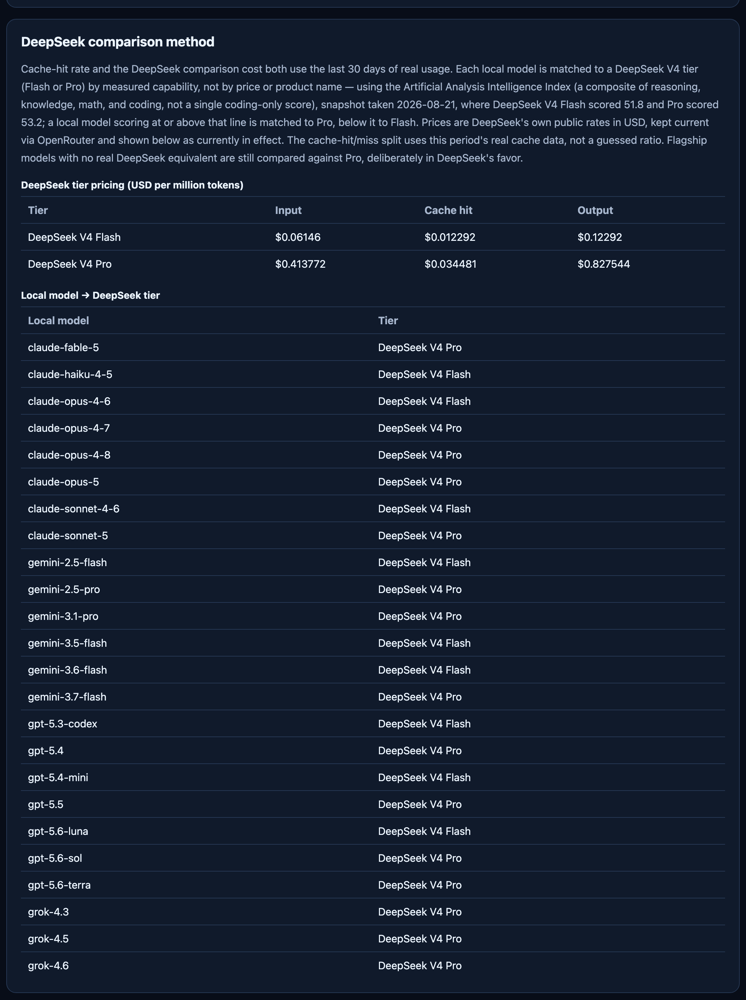

# AI Subscription Usage

[English](README.md) | [简体中文](README.zh-CN.md) | **日本語** | [한국어](README.ko.md) | [Français](README.fr.md) | [Deutsch](README.de.md) | [Español](README.es.md)

ChatGPT、Claude Code、Claude Desktop、Gemini CLI、Grok のローカル使用ログを読み取り、直近30日間の API 換算価値と実際に支払っているサブスクリプション費用を比較する、アカウント登録不要のメニューバー / システムトレイアプリです。すべての処理は自分のマシン上で完結します — AI API キー不要、アカウントログイン不要、OAuth/Auth Token/Cookie へのアクセスもなく、クラウドサービスも一切介在しません。

⭐ 自分のAIサブスクリプションが本当に見合っているかを見極める助けになったなら、Starをつけていただけると、もっと多くの人に届きます。

📺 **デモ動画：** YouTube（リンク準備中）・Bilibili（リンク準備中）

**機能**
- 30日間ダッシュボード：プロバイダーごとの合計/入力/出力トークン、API換算価値、有効サブスクリプションコスト、価値倍率
- 日次トークンおよび価値倍率チャート、モデル別内訳
- サブスクリプションプラン履歴（月額/年額、有効日で按分）
- ローカル使用ログの自動検出、非デフォルトフォルダを指定する安全なホワイトリスト方式にも対応
- 対応モデルの価格は [OpenRouter](https://openrouter.ai/) の公開 API 価格データから約1週間に1回自動更新——手動編集不要
- 7言語対応：English, Français, Deutsch, Español, 简体中文, 日本語, 한국어
- ログイン時自動起動、更新間隔の調整、ローカルデータフォルダへのワンクリックアクセス
- オプトイン方式の匿名診断のみ——会話内容、ファイルパス、認証情報は一切含まれません

**スクリーンショット**

| レポート | 設定 |
| --- | --- |
|  |  |

プロバイダー別の詳細（モデルごとのトークンと価値）、および中国語版レポート：


DeepSeek 比較とモデル対応表の詳細は、アプリ内の設定・使用ガイドに記載されています：



**入手方法**

[Releases](../../releases) ページから最新版をダウンロードしてください：
- **macOS**：`AI-Subscription-Usage-macOS.zip` — 解凍して `AI Subscription Usage.app` を Applications フォルダに移動します。
- **Windows**：通常インストール（スタートメニューへの登録、正常なアンインストール）をご希望の場合は `AI-Subscription-Usage-Windows-Setup.exe`、レジストリや Program Files に何も書き込みたくない場合は解凍してそのまま実行できる `AI-Subscription-Usage-Windows-Portable.zip` をどうぞ。

各リリースにはダウンロードの検証用に `SHA256SUMS.txt` も同梱されています。Windows ビルドは CI 上でコンパイル・自己テスト済みですが、実機の Windows での動作確認はまだ行われていません — 詳細は下の表をご覧ください。

ソースからビルドしたい場合：

```bash
python3 -m venv .venv-desktop
.venv-desktop/bin/pip install -r requirements-desktop.txt
.venv-desktop/bin/pip install pyinstaller
.venv-desktop/bin/pyinstaller --clean --noconfirm ai-subscription-usage.spec
```

macOS ビルドは `dist/AI Subscription Usage.app` に、Windows ビルドは `dist/AI Subscription Usage.exe` に生成されます。

## 現時点での検証状況

| プラットフォーム | macOS（デスクトップ＋CLI） | Windows（デスクトップ＋CLI） |
| --- | --- | --- |
| ChatGPT | ✅ 動作確認済み | 🟡 同じコードパスなので動作するはずだが、実機の Windows では未テスト |
| Claude | ✅ 動作確認済み（デスクトップと CLI は同じログを共有） | 🟡 デスクトップは専用の Windows パスを持ち、CLI も動作するはずだが未テスト |
| Gemini CLI | ✅ 動作確認済み | 🟡 動作するはずだが未テスト |
| Gemini Desktop（Antigravity/Spark） | ❌ 不可能であることを確認済み | ❌ 同じ製品のため恐らく不可能——個別には未確認 |
| Grok | 🟡 コードは正しいはずだが、このマシンには検証できる実際の Grok データがない | 🟡 同様に未検証、Windows でのテストも未実施 |

Gemini Desktop（Antigravity/Spark）はローカルセッション記録を暗号化ファイル（`~/.gemini/antigravity/conversations/*.pb`）として保存しており、読み取れる構造も、安全にアクセスできる公開ローカル API も存在しないため、トークン使用量を読み取ることができません——検出はされますが価格計算はされません。

Windows マシンをお持ちの方、実際に Grok をお使いの方は、テストとフィードバックを特に歓迎します——この2つは自分では検証できない部分です。問題があれば [Issue](../../issues) を開いてください。

## 概要

バージョン番号はトレイメニュー、レポートページ、ヘルプページに表示されます。macOS のユーザーデータは `~/Library/Application Support/AI Subscription Usage/` に、Windows では `%LOCALAPPDATA%\AI Subscription Usage\` に保存されます。アップグレードではプログラム本体、内蔵価格データベース、言語ファイル、アダプターのみが置き換わります——サブスクリプションプラン、データソース設定、言語設定、診断のオプトイン状態、ローカルレポートはインストーラーによって上書きされることはありません。設定を移行する前に、元のファイルはユーザーデータディレクトリの `backups/` にバックアップされます。

公開される GitHub リリースにはサブスクリプションプラン、検出結果、ローカルの絶対パス、トークン数、生成済みレポートは含まれません——検出結果はアプリがインストールされたマシン上でその都度リアルタイムに生成されるものです。リリースワークフローはまず `scripts/privacy_check.py` を実行し、失敗した場合はビルドを停止します。

## データソース

| プラットフォーム | ローカルフォルダ | 集計対象 |
| --- | --- | --- |
| ChatGPT | `~/.codex/sessions/` | 内部 Codex JSONL；入力、出力、キャッシュ入力 |
| Claude Code | `~/.claude/projects/` | 入力、出力、キャッシュ読み取り、キャッシュ書き込み |
| Claude Desktop | `~/Library/Application Support/Claude/local-agent-mode-sessions/` | デスクトップセッションを検出；トークン使用量は共有の Claude JSONL ログから集計 |
| Gemini CLI | `~/.gemini/tmp/*/chats/` | 入力、出力、思考、キャッシュトークン |
| Antigravity Desktop | `~/.gemini/antigravity/` | 自動検出；`.pb` 形式のトークンフィールドが未検証のため価格計算なし |
| Antigravity CLI | `~/.gemini/antigravity-cli/` | 自動検出；形式が未検証のため価格計算なし |
| Grok Build | `~/.grok/logs/unified.jsonl` | 正確な入力、出力、推論、キャッシュトークンを優先的に読み取り |
| Grok Build フォールバック | `~/.grok/sessions/**/signals.json` | `unified.jsonl` が存在しない場合のみ使用、推定値としてフラグ付け |

モデル名は `config/pricing.json` と完全に一致する必要があります。未知のモデルはトークンの集計は継続されますが、API 換算価値は計算されず、他のモデルの価格が適用されることもありません。価格データベースは有効日ごとに異なる価格を保存でき、履歴データにはその当日有効だった価格が使用されます。

## コマンドラインからの生成

```bash
python3 src/ai_usage_report.py --days 30
```

結果は `outputs/ai-usage-report.html` に書き出されます。右上の「ローカルデータを更新」ボタンは、デスクトップアプリが `127.0.0.1:17653` で提供するローカル更新エンドポイントに接続します。このポートはループバックにのみバインドされ、LAN やインターネットに公開されることはありません。

## macOS メニューバーと Windows トレイ

デスクトップアプリは、レポートを開く、今すぐ更新、モデル価格の更新、アプリの更新確認、言語切り替え、設定と使い方ガイド、匿名診断のオン/オフ、終了、といった機能を提供します。初回起動時には自動的に設定と使い方ガイドが開き、ローカルデータソースの検出状況、診断コマンド、自分のローカル AI アシスタントにそのままコピーできる安全な設定プロンプトが表示されます。デフォルトでは24時間ごとにローカルデータの更新とアプリバージョンの確認を行います。

## 自動検出と AI 支援設定

このアプリは登録済みのデフォルトフォルダのみをチェックし、ディスク全体をスキャンすることはありません。`AI Subscription Usage --doctor --json` を実行すると、ChatGPT、Claude Desktop、Claude Code、Gemini CLI、Antigravity Desktop、Antigravity CLI、Grok の検出状況を確認できます。デフォルト以外のフォルダは、制御されたコマンドで設定します：

```bash
AI\ Subscription\ Usage --configure-source --provider chatgpt --surface chatgpt-desktop --format codex-jsonl --path "$HOME/.codex/sessions"
AI\ Subscription\ Usage --verify-sources --json
```

`SETUP_WITH_AI.md` は、あなた自身の ChatGPT、Claude Code、Gemini CLI、その他のローカル AI アシスタントに渡すことができます——実行できるのは上記の読み取り専用診断コマンドと制御された設定コマンドのみです。設定ファイルがコマンド、ネットワークアドレス、認証情報、任意の解析コードを受け付けることはありません。

```bash
python3 -m venv .venv-desktop
.venv-desktop/bin/pip install -r requirements-desktop.txt
.venv-desktop/bin/python src/desktop_app.py
```

デスクトップアプリは常駐するメニューバー/トレイプロセスです。起動前に、他のプログラムがポート `17653` を使用していないことを確認してください。メニューから終了すると、トレイアイコンとローカル更新エンドポイントの両方が停止します。

## 多言語対応

デスクトップシェルには英語、フランス語、ドイツ語、スペイン語、簡体字中国語、日本語、韓国語のリソースが同梱されています。デフォルトでは OS の言語に従い、設定ページから切り替えることもできます。言語が変わっても、計算されるフィールドや価格データが変わることはありません。

## 価格データベースの更新

`config/pricing.json` には価格バージョン、公式ソース、モデル価格、有効日が保存されています。クライアントはマニフェストから価格更新をダウンロードし、SHA-256 チェックサムとフィールド構造を検証したうえで、ローカルの価格データベースをアトミックに置き換えます。このツールはトレンドを示すためのものであり、完全に正確な価格リファレンスを目指すものではないため、更新元には [OpenRouter](https://openrouter.ai/) の公開 API 価格データを使用しています——OpenRouter は著名な LLM プロキシで、API 価格は概ね公式レートに準拠しています。

`config/model_id_map.json` は、このプロジェクトのローカルモデル名を OpenRouter の正確なモデル ID に対応付けます。`scripts/fetch_pricing.py` はこのマップを使って現在の価格を取得し、`config/pricing.json` と `config/pricing-manifest.json` を書き換えます。`.github/workflows/update-pricing.yml` はこれを約1週間に1回自動実行し、実際に価格が変わった場合のみコミットします。実際の価格変更は日付付きの新しい期間として記録されるため、過去のレポート日付は当時実際に有効だったレートを使い続けます。すでに手動で日付スケジュールが設定されているモデルは、この自動化の対象外です。使用ログにマップ未登録の全く新しいモデル名が現れた場合は、`config/model_id_map.json` に1行追加されるまで単に「未計価」と表示されます——デスクトップアプリは新しいモデルを検出した瞬間にも、その場で価格更新を試みます。

各サービスの詳細タブには、その期間のキャッシュ命中率と、同じ使用量を [DeepSeek](https://www.deepseek.com/) で実行した場合の推定コストも表示されます。各モデルは能力クラスに応じて DeepSeek V4 の Flash または Pro ランクに対応付けられ（対応関係は `config/deepseek_tier_map.json` を参照）、DeepSeek 自身の公開価格（同じく OpenRouter 経由で最新の状態に保たれます）と、この期間の実際のキャッシュ命中/未命中の比率を使用します——推定した比率ではありません。DeepSeek に本当に対応するランクがないフラッグシップモデルも、あえて DeepSeek 側に有利になるよう Pro と比較されるため、この比較が誇張されることはありません。

## 匿名診断

匿名診断はデフォルトで無効になっており、設定で明示的に有効にした場合にのみアップロードされます。許可されるフィールドは、アプリバージョン、OS、言語、エラーモジュール、エラータイプ、匿名化されたスタックトレース、アダプターの状態に限られます。会話内容、プロンプト、返信、ユーザー名、ローカルファイルパス、API キー、サブスクリプション情報、トークンの内訳、生ログがアップロードされることはありません。`telemetry_endpoint` は診断受付が公開された時点で設定されます。

## 自動リリース

`.github/workflows/release.yml` は、バージョンタグがプッシュされた後にテストを実行し、macOS と Windows のビルド成果物を作成し、SHA-256 チェックサムを生成し、GitHub Release を作成します。完全自動アップデートには、さらに GitHub リポジトリアドレス、macOS Developer ID、公証用の認証情報、Windows コード署名証明書が必要です。

## ライセンス

このプロジェクトは [PolyForm Noncommercial 1.0.0](LICENSE) ライセンスの下で公開されています——非商用目的であれば自由に使用、学習、改変、共有できます。商用利用は許可されていません。ライセンスについて、または特定の利用方法について質問がある場合は、[Issue](../../issues) を開いてください。サードパーティのコードを再利用する場合は、そのライセンス、著作権表示、出典を `THIRD_PARTY_NOTICES.md` に記録する必要があります。
