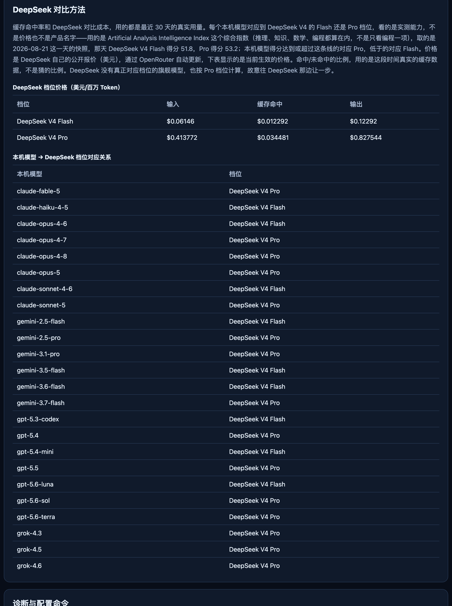

# AI Subscription Usage

[English](README.md) | **简体中文** | [日本語](README.ja.md) | [한국어](README.ko.md) | [Français](README.fr.md) | [Deutsch](README.de.md) | [Español](README.es.md)

一个本地运行、不用注册账号的菜单栏/系统托盘应用，读取本机 ChatGPT、Claude Code、Claude Desktop、Gemini CLI 和 Grok 的用量记录，把最近 30 天的 API 等价价值和你实际付的订阅费做对比。所有计算都在你自己的电脑上完成——不需要 AI API Key，不需要账号登录，不读取 OAuth/Auth Token/Cookie，也不经过任何云端服务。

⭐ 如果这个工具帮你看清了自己的 AI 订阅到底值不值，点个 Star 能让更多人也看到它。

📺 **视频演示：** [YouTube](https://youtu.be/VXnwn82lOsc) · B 站（链接即将上线）

**功能**
- 30 天仪表盘：每个平台的总/输入/输出 Token、API 等价价值、有效订阅成本和价值倍数
- 每日 Token 和每日价值倍数图表，按模型拆分明细
- 订阅计划历史（按月/按年，按生效日期分摊）
- 自动发现本机用量记录，也提供一个安全的、白名单式的方法指定非默认目录
- 已支持模型的价格大约每周自动从 [OpenRouter](https://openrouter.ai/) 的公开 API 价格数据更新一次，不用手动维护
- 支持七种语言：简体中文、English、日本語、한국어、Français、Deutsch、Español
- 开机自启、可调整刷新频率、一键打开本机数据文件夹
- 诊断信息默认关闭，需要手动开启才上传，且从不上传对话内容、文件路径或密钥

**截图**

| 报表 | 设置 |
| --- | --- |
|  |  |

各平台明细——包含真实的缓存命中率，以及同样这批用量如果换成 DeepSeek 大概要花多少钱（按实测能力对应档位，不是按价格或产品名字），以及中文版报表：


DeepSeek 对比用的方法和完整的模型对应关系表，都写在软件自带的"配置及使用说明"页面里：



**获取方式**

去 [Releases](../../releases) 页面下载最新版本：
- **macOS**：`AI-Subscription-Usage-macOS.zip`——解压后把 `AI Subscription Usage.app` 拖进"应用程序"文件夹。
- **Windows**：`AI-Subscription-Usage-Windows-Setup.exe` 是正常安装包（开始菜单快捷方式、能正常卸载）；如果不想往系统里装东西，也可以下 `AI-Subscription-Usage-Windows-Portable.zip`，解压后直接双击里面的 exe 运行。

每次发布都附带一个 `SHA256SUMS.txt`，可以用来校验下载文件没被篡改。Windows 版本在 CI 里编译并自测过，但还没有在真实 Windows 电脑上手动测试过，见下面表格。

想自己编译源码也可以：

```bash
python3 -m venv .venv-desktop
.venv-desktop/bin/pip install -r requirements-desktop.txt
.venv-desktop/bin/pip install pyinstaller
.venv-desktop/bin/pyinstaller --clean --noconfirm ai-subscription-usage.spec
```

macOS 编译结果在 `dist/AI Subscription Usage.app`；Windows 编译结果在 `dist/AI Subscription Usage.exe`。

## 各平台验证情况

| 平台 | Mac（桌面版 + 命令行） | Windows（桌面版 + 命令行） |
| --- | --- | --- |
| ChatGPT | ✅ 能，已验证 | 🟡 代码逻辑一样，理论上能，但没在真 Windows 上测过 |
| Claude | ✅ 能，已验证（桌面版和命令行走同一份记录） | 🟡 桌面版专门写了 Windows 路径，命令行理论上也行，但没在真 Windows 上测过 |
| Gemini CLI | ✅ 能，已验证 | 🟡 理论上能，没在真 Windows 上测过 |
| Gemini 桌面版（Antigravity/Spark） | ❌ 确认不行，文件是加密的 | ❌ 大概率也不行（同一个产品），但没在 Windows 上专门确认过 |
| Grok | 🟡 代码是对的，但本机没有真实 Grok 数据，没法验证准不准 | 🟡 同样没验证，而且 Windows 更没测过 |

Gemini 桌面版（Antigravity/Spark）把本地会话记录写成加密文件（`~/.gemini/antigravity/conversations/*.pb`），结构没法读，也没有公开、安全的本机接口，所以这部分 Token 用量读不出来——会显示"检测到但未计价"。

如果你有 Windows 电脑，或者正好在用 Grok，特别欢迎帮忙试用、反馈问题——这两块我们自己这边测不到。有问题请到 [Issues](../../issues) 里说一声。

## 概览

AI Subscription Usage 读取本机 ChatGPT、Claude Desktop、Claude Code、Gemini CLI、Antigravity 和 Grok 的公开本地用量记录，将最近 30 天 Token 按官方 API 单价折算，并与同区间订阅成本比较。计算、图表和刷新均由确定性程序完成，不需要任何 AI API Key。ChatGPT 当前使用内部 Codex JSONL 格式，因此默认数据目录仍是 `~/.codex/sessions/`。

版本号显示在托盘菜单、报表页和帮助页。macOS 用户数据保存在 `~/Library/Application Support/AI Subscription Usage/`，Windows 用户数据保存在 `%LOCALAPPDATA%\AI Subscription Usage\`。升级只替换程序、内置价格库、语言和适配器；订阅计划、数据源配置、语言、诊断授权和本机报表不会被安装包覆盖。迁移配置前会在用户数据目录的 `backups/` 中保存原文件。

GitHub 通用发布包不包含订阅计划、检测结果、本机绝对路径、Token 统计或生成报表。检测结果只在安装后的电脑上实时生成。发布工作流先执行 `scripts/privacy_check.py`，检查失败时停止构建。

macOS 版本运行在顶部菜单栏。Windows 版本运行在右下角系统托盘，由 GitHub Actions 的 Windows Runner 构建 `AI Subscription Usage.exe` 和 Inno Setup 安装程序。

报表顶部展示总 Token、输入 Token、输出 Token、API 等价价值、有效订阅成本和价值倍数。页面还提供四个平台的每日 Token、每日价值倍数、模型明细和未计价 Token。月订阅按 30 天、年订阅按 360 天分摊，计划生效日前不计算订阅成本。

## 数据来源

| 平台 | 本机目录 | 数据口径 |
| --- | --- | --- |
| ChatGPT | `~/.codex/sessions/` | 内部 Codex JSONL；输入、输出和缓存输入 |
| Claude Code | `~/.claude/projects/` | 输入、输出、缓存读取和缓存写入 |
| Claude Desktop | `~/Library/Application Support/Claude/local-agent-mode-sessions/` | 检测桌面会话；Token 使用量通过共享 Claude JSONL 汇总 |
| Gemini CLI | `~/.gemini/tmp/*/chats/` | 输入、输出、思考和缓存 Token |
| Antigravity Desktop | `~/.gemini/antigravity/` | 自动检测；当前 `.pb`格式未验证 Token 字段时不计价 |
| Antigravity CLI | `~/.gemini/antigravity-cli/` | 自动检测；未验证格式不计价 |
| Grok Build | `~/.grok/logs/unified.jsonl` | 优先读取精确输入、输出、推理和缓存 Token |
| Grok Build 降级来源 | `~/.grok/sessions/**/signals.json` | 仅在没有 `unified.jsonl` 时使用，标记为估算 |

模型名必须与 `config/pricing.json` 精确匹配。未知模型继续统计 Token，但不计算 API 等价价值，也不会套用其他模型价格。价格库支持按生效日期保存不同价格，历史记录使用当天有效价格。

## 命令行生成

```bash
python3 src/ai_usage_report.py --days 30
```

结果写入 `outputs/ai-usage-report.html`。页面右上角的"更新本机数据"按钮连接桌面应用在 `127.0.0.1:17653` 提供的本机刷新接口；端口只绑定回环地址，不对局域网或公网开放。

## macOS 菜单栏与 Windows 托盘

桌面应用提供打开报表、立即更新、更新模型价格、检查应用更新、切换语言、配置及使用说明、匿名诊断开关和退出。首次启动自动打开配置及使用说明，其中显示本机数据源检测状态、诊断命令和可复制给本机 AI 的安全配置提示词。默认每 24 小时更新一次本机数据并检查应用版本。

## 自动发现与 AI 辅助配置

应用只检查已登记的默认目录，不扫描整个硬盘。运行 `AI Subscription Usage --doctor --json` 查看 ChatGPT、Claude Desktop、Claude Code、Gemini CLI、Antigravity Desktop、Antigravity CLI 和 Grok 的检测状态。非默认目录使用受控命令配置：

```bash
AI\ Subscription\ Usage --configure-source --provider chatgpt --surface chatgpt-desktop --format codex-jsonl --path "$HOME/.codex/sessions"
AI\ Subscription\ Usage --verify-sources --json
```

`SETUP_WITH_AI.md` 可以交给用户自己的 ChatGPT、Claude Code、Gemini CLI 或其他本机 AI。AI 只能调用上述只读诊断与受控配置命令。配置文件不接受命令、网络地址、凭证或任意解析代码。

```bash
python3 -m venv .venv-desktop
.venv-desktop/bin/pip install -r requirements-desktop.txt
.venv-desktop/bin/python src/desktop_app.py
```

桌面应用是长期运行的菜单栏或托盘进程。启动前应确认本机没有其他程序占用 `17653`，退出菜单会关闭托盘和本机刷新接口。

## 多语言

桌面外壳包含简体中文、英语、日语、韩语、法语、德语和西班牙语资源，默认跟随操作系统语言，可从设置页切换。所有计算字段和价格数据库不因语言变化。

## 价格库更新

`config/pricing.json` 保存价格版本、官方来源、模型价格和生效日期。客户端从价格清单下载价格文件，先校验 SHA-256 和字段结构，再原子替换本机价格库。这个工具的定位是看个大概趋势，不是一个非常精准的报价工具，所以价格更新数据用的是 [OpenRouter](https://openrouter.ai/) 的公开 API 价格接口——它是知名的大模型中转站，API 价格一般跟官网保持一致。

`config/model_id_map.json` 把本项目本机的模型名字对应到 OpenRouter 那边确切的模型 id。`scripts/fetch_pricing.py` 按这张表去抓当前价格，重新生成 `config/pricing.json` 和 `config/pricing-manifest.json`；`.github/workflows/update-pricing.yml` 大约每周自动跑一次，价格真的变了才会提交。价格真的变化时会记成一条新的、带日期的价格区间，这样过去日期的报表还是按当时实际生效的价格算，不会被最新价格覆盖。已经手动写好日期区间的模型，自动流程不会去动它，交给人工维护。本机日志里出现全新的模型名字、对照表里还没有的，会先显示未计价，等 `config/model_id_map.json` 里加上一行才会计价——桌面应用侦测到新模型的那一刻，也会顺便自动尝试抓一次最新价格。

每个平台的详情标签页，还会显示这段时间的缓存命中率，以及"如果这批用量改用 [DeepSeek](https://www.deepseek.com/) 跑，大概多少钱"的估算。每个模型会按能力档位对应到 DeepSeek V4 的 Flash 或 Pro（对应关系见 `config/deepseek_tier_map.json`），价格用的是 DeepSeek 自己的公开价格（同样通过 OpenRouter 自动更新），命中/未命中的比例用的是这段时间真实的缓存数据，不是猜的比例。旗舰型号在 DeepSeek 那边没有真正对得上的档位，也还是按 Pro 来算，故意往 DeepSeek 那边让一步，这样比出来的结果不会显得对 DeepSeek 不公平。

## 匿名诊断

匿名诊断默认关闭，用户在设置页明确开启后才上传。允许字段只有应用版本、操作系统、语言、错误模块、错误类型、脱敏调用栈和适配器状态。禁止上传对话正文、提示词、回复内容、用户名、本机文件路径、API Key、订阅信息、Token 明细和原始日志。诊断入口发布后写入 `telemetry_endpoint`。

## 自动发布

`.github/workflows/release.yml` 在版本标签推送后执行测试，构建 macOS 与 Windows 产物，生成 SHA-256 校验文件并创建 GitHub Release。正式自动更新还需要 GitHub 仓库地址、macOS Developer ID、公证凭证和 Windows 代码签名证书。

## 许可证

本项目采用 [PolyForm Noncommercial 1.0.0](LICENSE) 许可证：可以免费使用、学习、修改和分享，但不能用于商业用途。对许可证有疑问，或者想确认某个用法算不算商业使用，欢迎在 [Issues](../../issues) 里联系我。复用第三方代码时仍需把对方的许可证、版权声明和来源写入 `THIRD_PARTY_NOTICES.md`。
